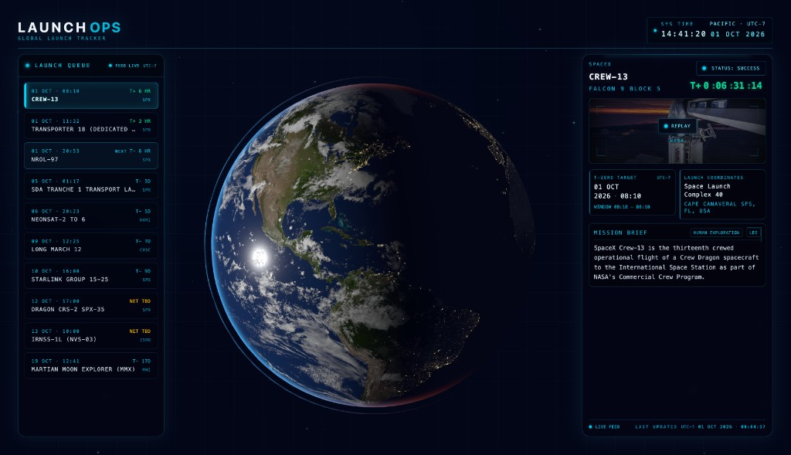

# LaunchOps

Global launch tracker dashboard for upcoming rocket launches.



Data is fetched from [The Space Devs Launch Library](https://thespacedevs.com/) (`mode=detailed`), stored in MongoDB, cached in Redis, and delivered to a React frontend over REST and Socket.IO. When a provider posts a webcast, YouTube plays in the mission camera pane; X and other hosts open outbound.

---

## Versions

- **1.0** — Launch queue, mission card, countdown, and in-app webcast.
- **1.1** — Current release. Adds a 12- and 24-hour clock, status colors, customers and agency marks, coarse NET handling, fitted mission titles, Earth on every screen size, a locked console, and a webcast that grows to 16:9.

---

## Features

- **Watch** — YouTube embeds in the camera pane (Watch / Replay / Close; live webcasts auto-open). While it plays, the pane is 16:9. From `md` up the card widens (`34rem`, `36rem` at `lg`, `40rem` at `xl`) so the picture can be watched; below `md` it grows inside the full-width card. X and other URLs open in a new tab (`Watch on X`, `Open webcast`). Queue **`STREAM`** replaces `T−` / `T+` / `NET TBD` while a webcast is live; **`LIVE` stays for In Flight**
- **Launch Queue** — upcoming launches with local NET (`09 OCT · 12:25 PM`, or `09 OCT · 12:25` in 24-hour). The clock follows Sys Time. The relative chip stays a duration (`T− 21 min`, `T+ 12 min`, `LIVE`, `HOLD`, `NET TBD`, `STREAM`). Provider abbreviation, dimmed past rows, and a `NEXT` marker on the in-flight or soonest upcoming launch (sidebar). Selection is by launch `apiId` (sticky across live cache refreshes) and defaults to in-flight or next NET
- **Mission detail panel** — provider and mission customers (customers only when they are not the provider), each beside an agency mark. The mark prefers the square social logo and falls back to the wordmark; a solid white or black field is punched out, and a failed image leaves the name. Mission and rocket titles. A parenthetical stays with the mission name. Below `lg`, one that cannot fit the title column on a single line is left off. On desktop, a long one still wraps under the name. A status pill with its own color per status (`docs/status-colors.png`). On the stacked card the pill sits on the title’s first line and does not push the countdown down. T− (cyan countdown) vs T+ (emerald elapsed) as `D:HH:MM:SS`, and provisional NET for TBD/TBC or coarse `net_precision` (day/month and coarser — no fake minute countdown)
- **T-Zero and launch site** — local date, plus a clock when NET is precise to the hour. That clock follows Sys Time (12-hour or 24-hour). Coarser targets hide the time and say how rough they are (`Day only`, `This month`). A real window replaces that caption. The offset stays on Sys Time, not on this tile. Launch Site leads with the place; a US state expands only for `{site}, {ST}, USA`. Below `md` the next line is the site only, and a long place or site name steps down until it fits on one line. From `md` up, the pad follows the site
- **Mission Brief** — description, with type and orbit as plain names on the title row. Unknown metadata is hidden. Placeholder copy (`Details TBD`) becomes `No public payload details yet.`
- **Live Feed indicator** — Socket.IO connect/disconnect status in the queue header (event flash on link change)
- **Last Updated** — provider `last_updated` as a local date and time, in the same hour cycle as Sys Time. The zone stays on Sys Time
- **Sys Time** — local clock with the shared zone name and offset (`Pacific · UTC-7`), not a reference city (San Jose stays Pacific, not Los Angeles). Half-hour zones use `UTC+5:30`. A `12h` / `24h` label beside Sys Time switches every clock face. It defaults to 12-hour and is remembered on the device. Seconds sit a step under the hours and minutes. Phone uses the same two lines as desktop: label and zone, then the time and date. Under 360px the clock drops onto its own row so that date still fits beside the time. At `xl` (1280px) the desktop clock steps up one size
- **Earth** — one globe. On a phone it is a short band above the card. From `md` until `lg` it is the left column beside a `22.5rem` card. At `lg+` it is the desktop hero between the queue and the card. Day and night follow real solar time. The earth spins on its poles, and the sun turns with it, so local time stays put. No orbit controls and no pad markers. Below `lg` the canvas always draws at 3×, including on a 2× screen. The desktop hero draws at up to 2×
- **HUD motion** — Framer Motion cold-load boot, launch-selection crossfade, ticking T− urgency vs calm T+, and a dimmed spinning starfield behind the globe
- **Live UI updates** — when the worker refreshes the cache, Redis Pub/Sub notifies the server, which emits the new payload to connected Socket.IO clients
- **Cached API** — `GET /launches` reads Redis first, then MongoDB on a cache miss
- **Scheduled ingestion** — cron worker polls Launch Library every 5 minutes, upserts MongoDB, writes Redis, and publishes a cache-update message
- **Responsive UI** — locked `dvh` console with safe-area insets. Nothing scrolls the page; a long brief scrolls inside the card. Below `md`: horizontal queue, short earth band, card fills the rest. From `md` until `lg`: queue on top, earth left, card `22.5rem`. At `lg+`: queue sidebar (320px), globe, and the mission card (`22.5rem`, `26rem` at `xl`)

### Watch ranking

`pickWatchTarget` runs on `LaunchCard` render (not in the worker). Priority: YouTube (in-app) > X > other hosts, then live URLs, then official (`Official Webcast` as a word-boundary match so Unofficial stays unofficial). `isWebcastLive` drives the queue `STREAM` chip from `webcast_live` or any `vid_urls[].live` flag.

X broadcasts cannot iframe (`SAMEORIGIN`). Empty `vid_urls` usually means the provider has not posted a stream yet.

---

## Architecture

```
Launch Library API  (?mode=detailed)
        |
        |  cron every 5 min (+ fetch on worker load)
        v
  Worker (node-cron)
        |
        |-- mapLaunch whitelist (incl. webcast_live, vid_urls)
        |-- upsert --> MongoDB
        |-- setEx ----> Redis key: upcoming-launches
        |-- publish --> Redis channel: launch-updates
                              |
                              v
                     Express + Socket.IO
                        |           |
              GET /launches    subscribe + emit
                        |           |
                        v           v
                   React (Vite) <-- live-launch-data
                              |
                              |  pickWatchTarget / isWebcastLive
                              v
                   Camera pane + STREAM chip
```

1. The **worker** fetches upcoming launches from The Space Devs API in **detailed** mode (`vid_urls` is omitted in `normal`).
2. `mapLaunch` keeps a field whitelist (including `webcast_live` and `vid_urls`); results are written to Redis and **upserted into MongoDB**.
3. A Redis Pub/Sub message on `launch-updates` notifies the API server.
4. The server emits `live-launch-data` over Socket.IO to connected clients.
5. On load, `useLaunchFeed` hydrates via `GET /launches` (Redis, then MongoDB on miss) and opens a Socket.IO connection (created on mount, torn down on unmount).
6. The same hook tracks Socket.IO `connect` / `disconnect` to drive the Live Feed indicator (including a one-shot flash when the uplink state changes) and replaces the list on `live-launch-data`. Sticky `apiId` selection lives there too (`pickDefaultApiId` when none is set or the previous pick left the queue).
7. Each card / queue row **ranks watch URLs at render time**. A cache refresh rerenders with the new `vid_urls`.

The worker is required by `server.js`, so it runs in the same Node process as the API.

On the frontend, `App.tsx` is the console **shell**: it calls `useLaunchFeed`, `useHourCycle`, and `useSysClock`, derives `selectedIndex`, and composes UI regions (`Starfield`, `ConsoleHeader`, `LaunchQueue`, `GlobePanel`, `LaunchCard`). `GlobePanel` is lazy-loaded. The shell mounts the one canvas — the phone band below `lg`, otherwise the desktop hero — outside the `apiId`-keyed card motion, so selecting a launch does not remount it. `solarAttitude` places the day/night terminator from UTC; a slow polar spin is added to both the earth and the sun so continents turn while local time stays put. `LaunchCard` is the mission-panel **orchestrator** under `components/LaunchCard/`: density, `useCountdown` (the card's 1s T−/T+ tick — owned by LaunchCard, not App), derived copy, watch playing state, and Framer stagger. The card is always stacked. Presentational regions are `LaunchCardIdentity` (titles, customers, status/countdown), `LaunchCardVisual` (HUD still, Watch/Close, YouTube IFrame API host), `LaunchCardMission` (T-Zero, launch site, brief), and `LaunchCardFooter` (last updated). Density spacing/type tokens live in `lib/cardDensityChrome.ts`. Shared domain helpers live under `utils/` (titles, pad place, T−/T+ chips, default selection, local time, hour cycle, zone name, solar attitude, watch target, and live-player resync) with contract tests.

---

## Tech Stack

| Layer           | Technology                                                        |
| --------------- | ----------------------------------------------------------------- |
| Frontend        | React 19, TypeScript (partial), Vite, Tailwind CSS v4, Framer Motion |
| Globe           | three.js, React Three Fiber; WebGPU with a WebGL2 fallback            |
| Realtime        | Socket.IO (client + server)                                          |
| Backend         | Node.js, Express 5                                                   |
| Worker          | node-cron                                                            |
| Database        | MongoDB via Mongoose                                                 |
| Cache / Pub-Sub | Redis                                                                |
| External data   | [The Space Devs Launch Library 2.3](https://ll.thespacedevs.com/)    |
| Analytics       | Vercel Analytics                                                     |
| Hosting         | Frontend on **Vercel**; backend on **Render**                        |
| Tests           | Vitest (frontend), `node:test` (backend)                             |
| CI              | GitHub Actions on pull requests and pushes to `main`                 |
| Source control  | [GitHub](https://github.com/brshin/launch-ops)                       |

---

## Project Structure

```
launch-ops/
├── .github/
│   └── workflows/
│       └── test.yml           # CI: frontend + backend `npm test`
├── docs/
│   ├── console.jpg            # README console screenshot
│   └── status-colors.png      # Status pill color sheet
│
├── backend/
│   ├── models/
│   │   └── Launch.js          # Mongoose schema (incl. webcast_live, vid_urls)
│   ├── mapLaunch.js           # Launch Library payload → stored documents
│   ├── mapLaunch.test.js
│   ├── server.js              # Express API, Socket.IO, Redis subscriber
│   ├── worker.js              # Cron ingestion (mode=detailed), Redis publish, Mongo upsert
│   └── package.json
│
├── frontend/
│   ├── public/
│   │   ├── favicon.svg
│   │   └── textures/                 # 4K earth day, night, and packed maps
│   ├── src/
│   │   ├── components/
│   │   │   ├── Starfield.tsx         # Ambient space background
│   │   │   ├── Globe/
│   │   │   │   └── GlobePanel.tsx    # Earth canvas (solar time, polar spin)
│   │   │   ├── ConsoleHeader.tsx     # Brand + Sys Time (zone · offset, 12h/24h)
│   │   │   ├── HourCycleFade.tsx     # Crossfade when the hour cycle changes
│   │   │   ├── LaunchQueue.tsx       # Horizontal strip / sidebar queue (+ STREAM)
│   │   │   ├── LaunchCard/
│   │   │   │   ├── LaunchCard.tsx         # Mission panel orchestrator + watch state
│   │   │   │   ├── LaunchCardIdentity.tsx # Titles, status pills, countdown
│   │   │   │   ├── LaunchCardVisual.tsx   # HUD still, Watch/Close, YouTube host
│   │   │   │   ├── LaunchCardMission.tsx  # T-Zero, launch site, brief
│   │   │   │   └── LaunchCardFooter.tsx   # Last updated
│   │   │   ├── CountdownReadout.tsx  # Ticking countdown + status labels
│   │   │   └── FeedStatus.tsx        # Live/offline feed indicator
│   │   ├── hooks/
│   │   │   ├── useLaunchFeed.ts               # REST hydrate, Socket.IO, sticky apiId
│   │   │   ├── useSysClock.ts                 # Local Sys Time tick
│   │   │   ├── useHourCycle.ts                # 12h/24h choice, including other tabs
│   │   │   ├── useCountdown.ts                # LaunchCard 1s T−/T+ tick
│   │   │   ├── useConsoleBoot.ts              # Cold-load boot window
│   │   │   ├── useCompactMotion.ts            # Below-lg motion; gates the phone earth
│   │   │   ├── useFitLine.ts                  # Fit a place or site name on one line
│   │   │   ├── useShortViewportBand.ts        # Short/mid/roomy height bands
│   │   │   ├── useCardDensityBand.ts          # LaunchCard stacked density
│   │   │   └── useConsoleScrollbarActivity.ts # Show thumbs while scrolling
│   │   ├── lib/
│   │   │   ├── motionTokens.ts        # Shared Framer transition presets
│   │   │   ├── bootMotion.ts          # Boot-sequence motion variants
│   │   │   └── cardDensityChrome.ts   # LaunchCard spacing/type by density
│   │   ├── types/
│   │   │   └── launch.ts             # Frontend launch types
│   │   ├── utils/
│   │   │   ├── launchTitle.ts        # Mission/rocket titles, customers, mark URLs
│   │   │   ├── launchTitle.test.ts
│   │   │   ├── agencyMarkImage.ts    # Punch a solid field out of an agency mark
│   │   │   ├── launchTime.ts         # Relative T−/T+ chips and NET precision honesty
│   │   │   ├── launchTime.test.ts
│   │   │   ├── queueFocus.ts         # Default queue selection (live, else next NET)
│   │   │   ├── queueFocus.test.ts
│   │   │   ├── localTime.ts          # Local date/time, UTC offset, shared zone name
│   │   │   ├── localTime.test.ts
│   │   │   ├── hourCycle.ts          # Read/write the device hour cycle (default 12)
│   │   │   ├── hourCycle.test.ts
│   │   │   ├── padPlace.ts           # Place line vs site name for Launch Site
│   │   │   ├── padPlace.test.ts
│   │   │   ├── solarAttitude.ts      # Subsolar point for the globe terminator
│   │   │   ├── solarAttitude.test.ts
│   │   │   ├── watchTarget.ts        # Rank YouTube vs X vs other; live/watch/replay
│   │   │   ├── watchTarget.test.ts
│   │   │   ├── youtubeLiveResync.ts  # IFrame API mount + live-head resync
│   │   │   └── youtubeLiveResync.test.ts
│   │   ├── App.tsx                   # Shell: hooks, selection index, layout
│   │   ├── main.jsx                  # React root, MotionConfig, Analytics
│   │   └── index.css                 # Console insets, short bands, scrollbars
│   ├── index.html
│   ├── vite.config.js
│   └── package.json
│
└── README.md
```

---

## Getting Started

### Prerequisites

- Node.js with native `fetch` support (used by the worker)
- MongoDB connection string
- Redis instance

### 1. Clone

```bash
git clone https://github.com/brshin/launch-ops.git
cd launch-ops
```

### 2. Backend

```bash
cd backend
npm install
```

Create `backend/.env`:

```env
MONGODB_URI=your_mongodb_connection_string
REDIS_URL=your_redis_url
FRONTEND_URL=http://localhost:5173
PORT=3000
```

```bash
node server.js
```

Listens on port `PORT`, or `3000` if unset. `GET /` returns plain text that the process is listening.

### 3. Frontend

```bash
cd frontend
npm install
```

Create `frontend/.env`:

```env
VITE_API_URL=http://localhost:3000
```

```bash
npm run dev
```

Vite default local URL is `http://localhost:5173`.

For LAN / phone preview on the same network:

```bash
npm run dev -- --host
```

Then open `http://<your-computer-ip>:5173` on the device.

### 4. Production frontend build

```bash
cd frontend && npm run build && npm run preview
```

### 5. Tests

Contract tests for queue chips/phases, titles, agency marks, pad place, default selection, watch ranking, live-player resync, solar attitude, local zone names, hour cycle, and Launch Library → `apiId` / webcast field mapping. No Redis or Mongo required.

```bash
cd frontend && npm test
cd backend && npm test
```

GitHub Actions runs the same commands on pull requests and pushes to `main`.

---

## Environment Variables

### Backend (`backend/.env`)

| Variable       | Description                                                                                                                            |
| -------------- | -------------------------------------------------------------------------------------------------------------------------------------- |
| `MONGODB_URI`  | MongoDB connection string                                                                                                              |
| `REDIS_URL`    | Redis connection URL                                                                                                                   |
| `FRONTEND_URL` | Socket.IO CORS `origin` (falls back to `*` if unset). Express `cors()` is enabled with default options and does not use this variable. |
| `PORT`         | HTTP port (defaults to `3000`)                                                                                                         |

### Frontend (`frontend/.env`)

| Variable       | Description                                                                     |
| -------------- | ------------------------------------------------------------------------------- |
| `VITE_API_URL` | Backend base URL for REST and Socket.IO (falls back to `http://localhost:3000`) |

`.env` files are listed in the root `.gitignore` and should not be committed.

---

## API

| Method | Path        | Description                                                          |
| ------ | ----------- | -------------------------------------------------------------------- |
| `GET`  | `/`         | Returns plain text confirming the process is listening               |
| `GET`  | `/launches` | Upcoming launches from Redis, or MongoDB if the cache key is missing |

Each launch document may include `webcast_live` (boolean) and `vid_urls` (Launch Library video objects). The UI derives playable vs outbound links from those fields; the API does not precompute a watch target.

### Socket.IO

| Event                       | Direction       | Description                                                                 |
| --------------------------- | --------------- | --------------------------------------------------------------------------- |
| `connection` / `disconnect` | Client ↔ Server | Connection lifecycle (logged on the server; drives Live Feed in the client) |
| `live-launch-data`          | Server → Client | Parsed `upcoming-launches` Redis payload after a Pub/Sub notification       |

---

## Deployment

| Service  | Platform |
| -------- | -------- |
| Frontend | Vercel   |
| Backend  | Render   |

The repository is on GitHub and connected to those hosts. Configure platform env vars to match the tables above (`VITE_API_URL` on Vercel; `MONGODB_URI`, `REDIS_URL`, `FRONTEND_URL`, and `PORT` on Render as needed).

---

## Data Source

```
GET https://ll.thespacedevs.com/2.3.0/launches/upcoming/?mode=detailed
```

- **`mode=detailed`** is required for `vid_urls`. `webcast_live` also appears in `normal` mode. Mapping still whitelists only those two extra fields (no timelines or other detailed payload).
- Cron schedule: every **5 minutes** (`*/5 * * * *`)
- An initial fetch also runs when the worker module loads
- Worker Redis write TTL: **86400 seconds** (24 hours)
- On `GET /launches` cache miss, the server may write MongoDB results to Redis with a **120 second** TTL

---

## License

`backend/package.json` lists `ISC`. The frontend package is marked `"private": true`. There is no project-level `LICENSE` file.
